# pigeonline

Web application developed using PHP that implements a messaging platform between users.

link to the site: https://pigeonline.altervista.org/

After registering you have to wait for the confirmation email (it may take some time to arrive).

## Table of contents
* [Initial page](#initial-page)
* [Sign in](#sign-in)
* [Sign up](#sign-up)
* [Manage friends](#manage-friends)
* [Find users](#find-users)
* [Send friend request](#send-friend-request)
* [Cloud chat](#cloud-chat)
* [Private chat](#private-chat)
* [Private chat details](#private-chat-details)
* [Channel and Group details](#channel-and-group-details)
* [Modify profile](#modify-profile)
* [Security](#security)

## Initial Page
This is the initial page, from there you can register to the site or login. 
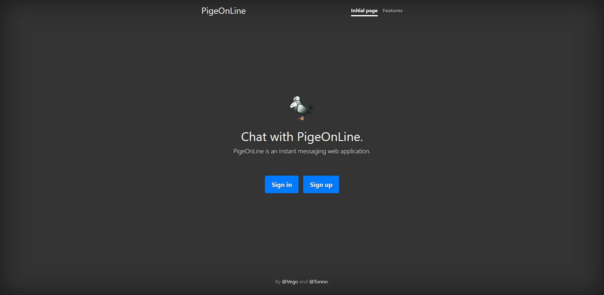

## Sign in
From there you can sign in with your username or email, and password.
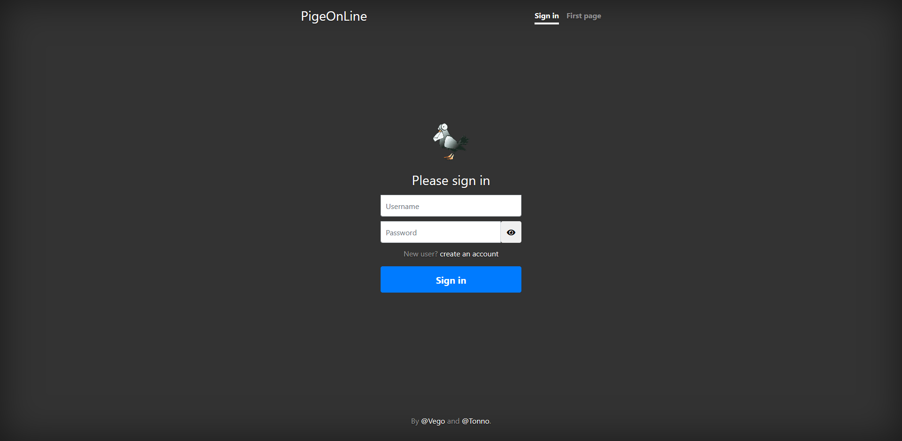

## Sign up
This is the registration form, you must use a valid email because the site will send you a confirmation email.
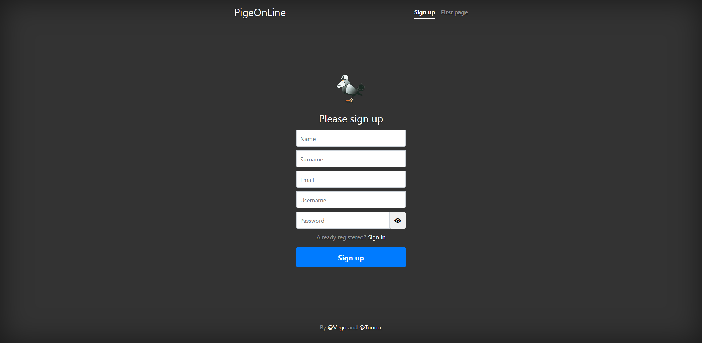

## Manage friends
From the friend page, you can manage your friends (for example you can remove or block users and more)
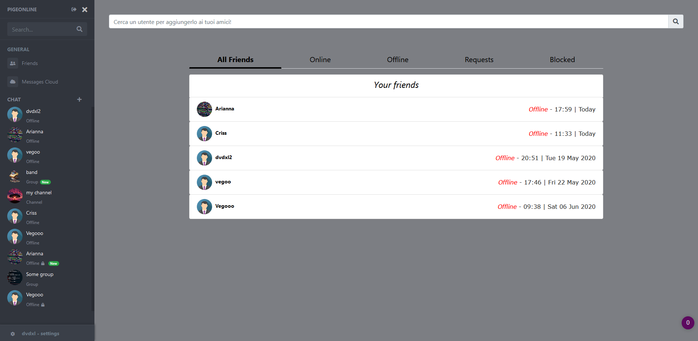

## Find users
From the friend page, you can also search for new friends...
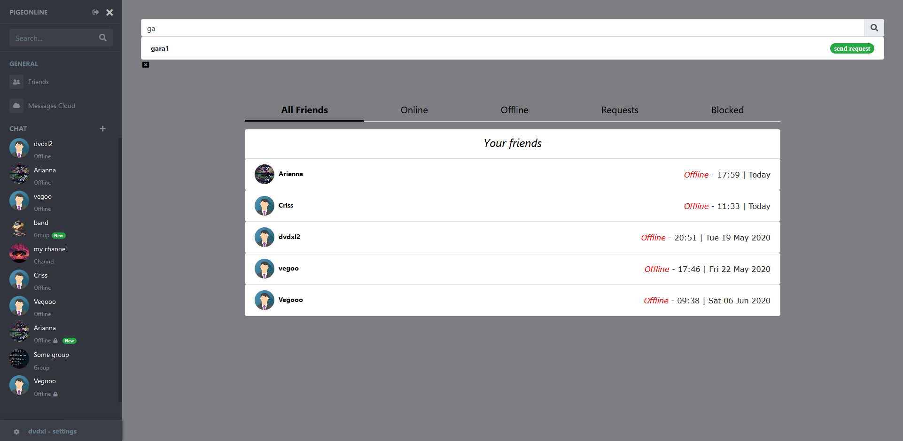

## Send friend request
...and send a friend request (You can chat only with your friends)
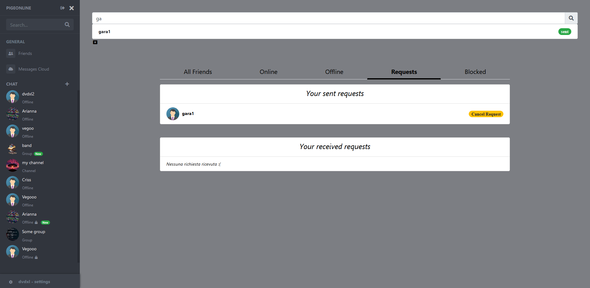

## Cloud chat
This is a particular chat only with yourself that allows you to save messages and data
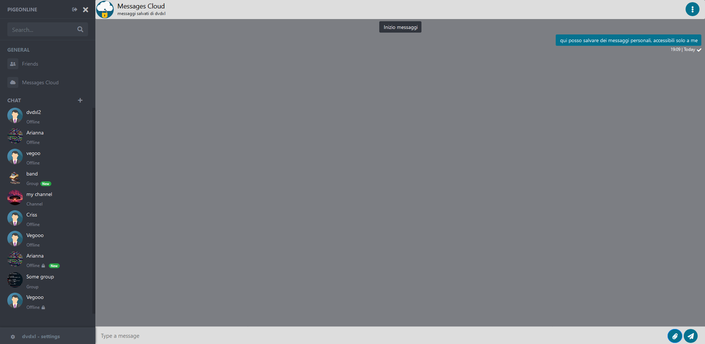

## Private chat
You can create a private chat with your friend
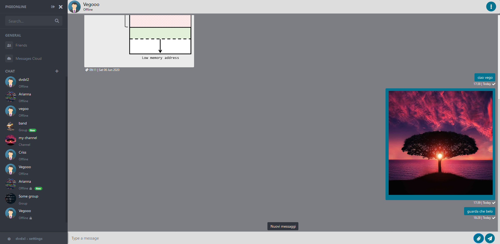

## Private chat details
You can see the details of every chat
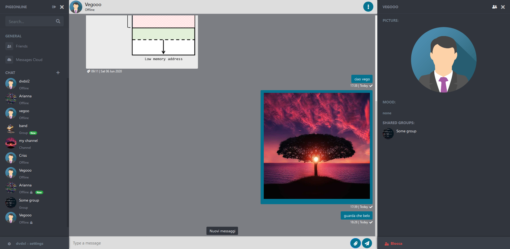

## Channel and Group details
You can also create channels (where only the admins can write) and groups (where everyone can write) and see details. If you are an admin you can also modify the details of the group/channel and add/remove/make admin other users.
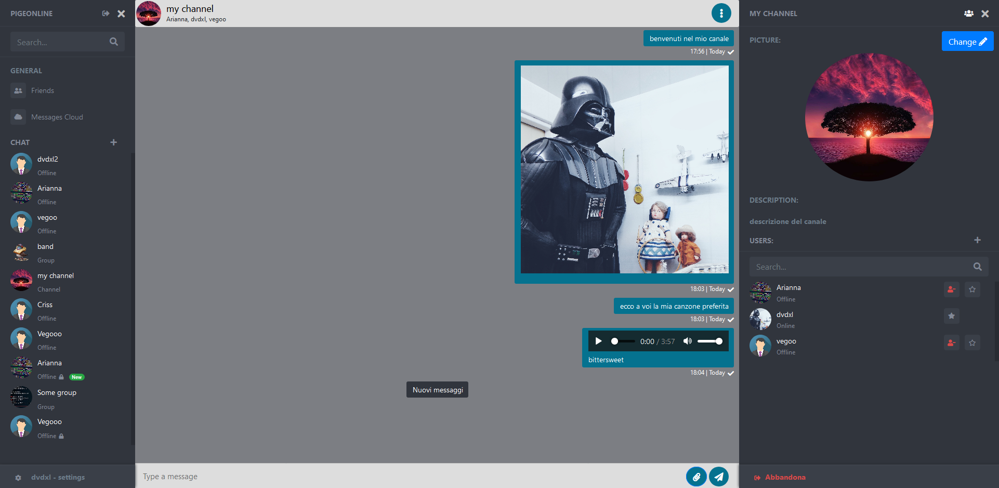

## Modify profile
From there you can modify your profile and your privacy level.
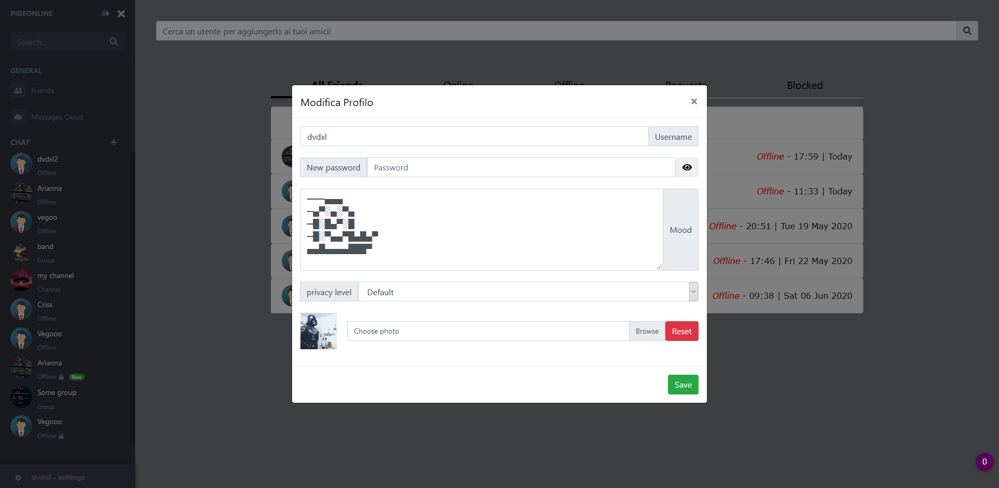

## Security
This site provides a valid security level by adding:
* an internal firewall that bans every malicious user by his profile or IP address,
* secured chat is a particular type of chat that automatically erase messages from the database every time they are read by the recipient and encrypt all the messages by using a public key algorithm.
